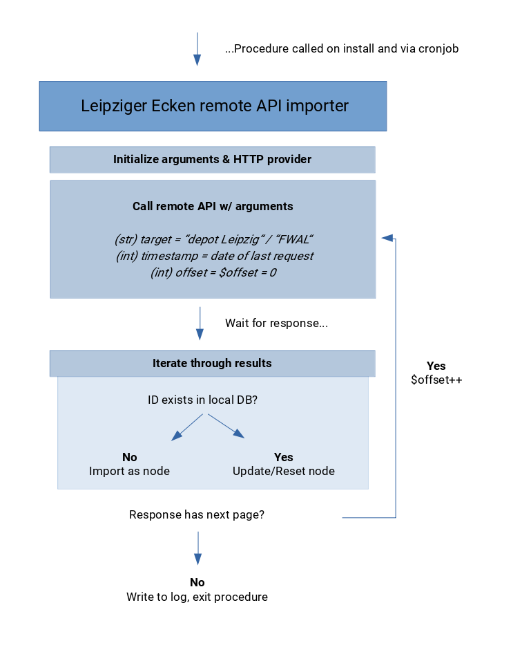

## Leipziger Ecken Remote API Services

Provides API integration & import routines for the following remote services:

* [depot.social](https://leipzig.depot.social)
* [Freiwilligen Agentur Leipzig](https://www.freiwilligen-agentur-leipzig.de)

**Requires a valid authentication key for each of these providers (see below).**

The code of this module was inspired by the official [Drupal 8 HttpClientManager introduction](https://www.drupal.org/docs/8/modules/http-client-manager) and http_client_manager_example-module (shipped with  http_client_manager).

The connected APIs will be recursively scanned for new or updated entities which then become cloned into local Drupal entities which are elsewhere defined as features.
There are three ways to start the import routine: Per cronjob (suggested) or on a per-service-level via [http client manager interface](/admin/config/services/http-client-manager).


### Installation
In settings.php, paste this configuration and replace with your API-credentials:

```php
$settings['le_remote_api_fwal_agency_id'] = __INT__;
$settings['le_remove_api_fwal_access_key'] = __STRING__;
$settings['http_services_api']['le_remote_api_services_depot_social.contents']['config']['auth'] = [__USERNAME__, __PASSWORD__, 'Basic'];
```

### Flowchart



