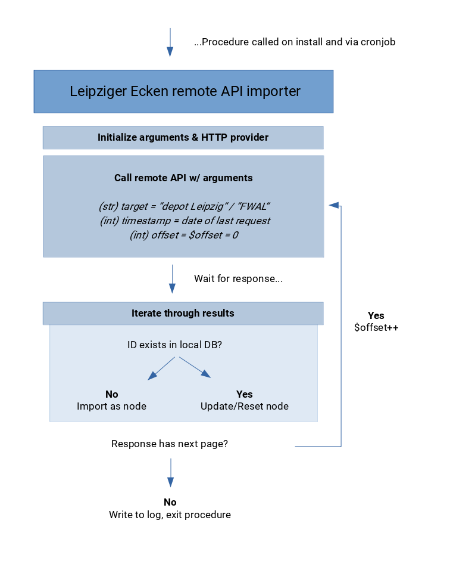

## Leipziger Ecken Remote API Services

### Attention: Heavy WIP! To use this module in the wild you will need to get credentials from the providers listed further down!

Provides API integration & import routines for the following remote services:

* [depot.social](https://leipzig.depot.social)
* [Freiwilligen Agentur Leipzig](https://www.freiwilligen-agentur-leipzig.de) **WIP**

The code of this module was inspired by the official [Drupal 8 HttpClientManager introduction](https://www.drupal.org/docs/8/modules/http-client-manager) and http_client_manager_example-module (shipped with  http_client_manager).

The integrated APIs will be recursively scanned for new or updated entities which then become copied into the local entity-types-stack whose structure is defined in the child's feature module.

**How?** There are three ways to start the import routine: Once on module install, once per cronjob (usually daily) or on a per-service-level via the (web interface)[/admin/config/services/http-client-manager/le_remote_api_services_depot_social.contents].

### Flowchart

