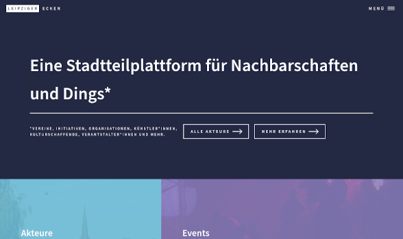

 # swinger theme



 A demo theme for Leipziger Ecken V2. Based on the HTML-template *Forty by HTML5 UP* ([CCA 3.0 license](https://html5up.net/license)). Inherits from *Classy* core-theme (the suggested way).
 
 This theme is meant for **development purposes** only as it displays content in a nicer, minimalistic way compared to core default themes, but has no guarantee for e.g. completeness or enhanced semantics.

 #darkmode #minimal-ui #mobilefirst

 ### Installation & use

 If you want to work on the CSS code, you will have to write SASS code which then is turned into "native" CSS by a parser. In *swinger*, all content from /sass-folder will become bundled into a single /css/main.css, meaning it will **overwrite** any changes offhand made in that file directly.

 To do bundling you can use any GUI-based SASS-tool available for your OS (e.g. [Koala](http://koala-app.com/)). The suggested way goes via npm, yet another command-line utility that you first have to [install](https://nodejs.org/en/download/). Then, in the terminal, first change into this theme-directory:
 ```console
 cd /web/sites/themes/swinger
 ```
 and install all npm-dependencies (meaning: [Grunt](https://gruntjs.com/), a popular, Javascript-based task runner with some extensions):
 ```console
 npm install
 ```
 Finally, you can bundle your SASS-code (until now, you will have to do this every time you changed any code in the sass-folder):
 ```console
 npm start
 ```